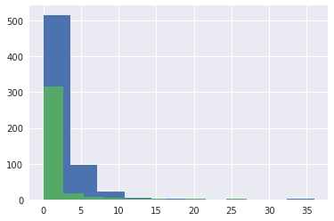
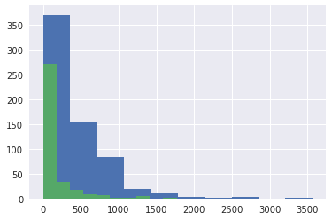
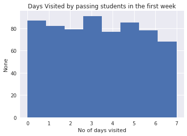
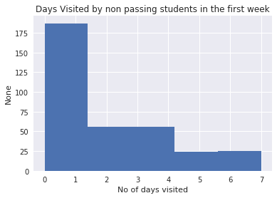

# Lesson 1: Data Analysis Process

> Based Udacity's UD170 Introduction to Data Analysis. Last Updated 7th Feb 2017.

## Data Analysis Process

__Phases__

Question Phase -> Wrangling Phase -> Data Exploration Phase -> Drawing Conclusions Phase -> Communication Phase.

- Not a straight path. Sometimes you need to move back and forth in this process.

__Data__: Data for this lesson was a Udacity Student Data, such as enrollments, daily engagement and project submissions.

Details about the data can be found here.

1. __Question Phase__:
    - Asking Question about the Data.
    - eg. What are the Characterstics of students who pass the projects?
    - eg. How to best stock yout store to maximize profits?
    - eg. How much sleep I am getting daily?

2. __Data Wrangling Phase__:
    - Data Acquistion - Getting/Storing the Data.
    - Data Cleaning - Cleaning the data for inconsistencies or missing pieces such that it doesn't have any negative effect on the entire data analysis process.

3. __Data Exploration Phase__:
    - Build some Intuitions about the data. May be by looking at the raw plots of data.
    - Find Patterns

4. __Drawing Conclusions Phase__(Or __Making Predictions Phase__):
    - Conclude/Predict based on the Exploration Phase.
    - This part usually requires some Statistics and Machine Learning.
    - Try to find answers to your questions from the Questions Page.

5. __Communications Phase__:
    - This is where you communicate your findings from Conclusions/Predictions Phase.
    - It could be in form of a Blog post, Paper, Email, Powerpoint or even a simple conversation.
    - Data Visualization is almost always useful in communicate your findings.

## Data Analysis and other related terms

- __Data Science__: Very Similar to Data Analysis. Mostly refers to making recommendations or predictions based on the data, while Data Analysis refers to study data to learn some features of data. May require more experience.

- __Data Engineering__: More Focussed on Data Wrangling part of Data Analysis. Involves data processing and storage.

- __Big Data__: Fuzzy term to describe "a lot of" data that today's companies collect, store, process and analyze.


## Data Analysis Process Walkthrough w/ Example Data.

```python
# Reading data from a CSV file

import unicodecsv

def read_csv(filename):
    with open(filename, 'rb') as f:
        return list(unicodecsv.DictReader(f))


enrollments = read_csv('data_files/enrollments.csv')

daily_engagement = read_csv('data_files/daily_engagement.csv')

project_submissions = read_csv('data_files/project_submissions.csv')
```


```python
enrollments[0]
```

__OUTPUT__


    {u'account_key': u'448',
     u'cancel_date': u'2015-01-14',
     u'days_to_cancel': u'65',
     u'is_canceled': u'True',
     u'is_udacity': u'True',
     u'join_date': u'2014-11-10',
     u'status': u'canceled'}


```python
daily_engagement[0]
```

__OUTPUT__


    {u'acct': u'0',
     u'lessons_completed': u'0.0',
     u'num_courses_visited': u'1.0',
     u'projects_completed': u'0.0',
     u'total_minutes_visited': u'11.6793745',
     u'utc_date': u'2015-01-09'}


```python
project_submissions[0]
```

__OUTPUT__


    {u'account_key': u'256',
     u'assigned_rating': u'UNGRADED',
     u'completion_date': u'2015-01-16',
     u'creation_date': u'2015-01-14',
     u'lesson_key': u'3176718735',
     u'processing_state': u'EVALUATED'}


```python
# Cleaning / Fixing Data Types

from datetime import datetime as dt

def parse_date(date_str):
    return dt.strptime(date_str, "%Y-%m-%d") if date_str != '' else None

def parse_maybe_int(int_str):
    return int(int_str) if int_str != '' else None
```


```python
# Clean up the data types in the enrollments table
for enrollment in enrollments:
    enrollment['cancel_date'] = parse_date(enrollment['cancel_date'])
    enrollment['days_to_cancel'] = parse_maybe_int(enrollment['days_to_cancel'])
    enrollment['is_canceled'] = enrollment['is_canceled'] == 'True'
    enrollment['is_udacity'] = enrollment['is_udacity'] == 'True'
    enrollment['join_date'] = parse_date(enrollment['join_date'])

enrollments[0]
```

__OUTPUT__


    {u'account_key': u'448',
     u'cancel_date': datetime.datetime(2015, 1, 14, 0, 0),
     u'days_to_cancel': 65,
     u'is_canceled': True,
     u'is_udacity': True,
     u'join_date': datetime.datetime(2014, 11, 10, 0, 0),
     u'status': u'canceled'}


```python
# Clean up the data types in the engagement table
for engagement_record in daily_engagement:
    engagement_record['lessons_completed'] = int(float(engagement_record['lessons_completed']))
    engagement_record['num_courses_visited'] = int(float(engagement_record['num_courses_visited']))
    engagement_record['projects_completed'] = int(float(engagement_record['projects_completed']))
    engagement_record['total_minutes_visited'] = float(engagement_record['total_minutes_visited'])
    engagement_record['utc_date'] = parse_date(engagement_record['utc_date'])

```


```python
daily_engagement[0]
```

__OUTPUT__


    {u'acct': u'0',
     u'lessons_completed': 0,
     u'num_courses_visited': 1,
     u'projects_completed': 0,
     u'total_minutes_visited': 11.6793745,
     u'utc_date': datetime.datetime(2015, 1, 9, 0, 0)}


```python
# Clean up the data types in the submissions table
for submission in project_submissions:
    submission['completion_date'] = parse_date(submission['completion_date'])
    submission['creation_date'] = parse_date(submission['creation_date'])

project_submissions[0]
```

__OUTPUT__


    {u'account_key': u'256',
     u'assigned_rating': u'UNGRADED',
     u'completion_date': datetime.datetime(2015, 1, 16, 0, 0),
     u'creation_date': datetime.datetime(2015, 1, 14, 0, 0),
     u'lesson_key': u'3176718735',
     u'processing_state': u'EVALUATED'}


##  Some Questions you could answer with this data? - Questions Phase
- How long did it take for students to submit the projects?
- How many students cancelled the course?
- How many students submitted the project?
- How many students passed the project?
- Correlation between daily engagement and project submissions?
- Enrollments by time?

[More from the forums](https://discussions.udacity.com/t/share-questions-about-student-data/37972/3)


```python
for engagement in daily_engagement:
    engagement['account_key'] = engagement['acct']
    engagement.pop('acct', None)

daily_engagement[0]
```


__OUTPUT__

    {'account_key': u'0',
     u'lessons_completed': 0,
     u'num_courses_visited': 1,
     u'projects_completed': 0,
     u'total_minutes_visited': 11.6793745,
     u'utc_date': datetime.datetime(2015, 1, 9, 0, 0)}


```python
daily_engagement[0]['account_key']
```

__OUTPUT__


    u'0'


```python
# Finding No of unique student keys & no of csv rows.

def get_no_of_uniques(dataset, unique_key='account_key'):
    unique = set()

    for data in dataset:
        unique.add(data[unique_key])

    return len(unique), unique


enrollment_num_rows = len(enrollments)
enrollment_num_unique_students, enrollment_set_unique_students  = get_no_of_uniques(enrollments)

engagement_num_rows = len(daily_engagement)
engagement_num_unique_students, engagement_set_unique_students = get_no_of_uniques(daily_engagement)

submission_num_rows = len(project_submissions)
submission_num_unique_students, submission_set_unique_students = get_no_of_uniques(project_submissions)

print("enrollment_num_rows: %d" % enrollment_num_rows)
print("enrollment_num_unique_students: %d" % enrollment_num_unique_students)

print("engagement_num_rows: %d" % engagement_num_rows)
print("engagement_num_unique_students: %d" % engagement_num_unique_students)

print("submission_num_rows: %d" % submission_num_rows)
print("submission_num_unique_students: %d" % submission_num_unique_students)
```
__OUTPUT__

    enrollment_num_rows: 1640
    enrollment_num_unique_students: 1302
    engagement_num_rows: 136240
    engagement_num_unique_students: 1237
    submission_num_rows: 3642
    submission_num_unique_students: 743


## Problems with the Data:

1. There are more unique students in the enrollments table than in the engagements table. [Engagement table is supposed to have 1 row per enrolled student per day]

2. The unique account key is named `account_key` in 2 tables while its called `acct` in the engagements table. This is not a big issue, but an convenience. I'll fix this below. ["I have moved this code above"]

#### __Investigating this missing data__:
- Identify surprising data points -> Enrollment records with no engagement records.
- Print out one/more of the surprising data points.
- Fix any problems you find with the data
    - More Investigation may be needed.
    - Or there might not be a problem. Missing data may be natural.


```python
# Investigating surprising data:

for enrollment in enrollments:
    if enrollment['account_key'] not in engagement_set_unique_students and enrollment['days_to_cancel'] > 0:
        print("enrollment not in engagement %s" % enrollment)


```
__OUTPUT__

    enrollment not in engagement {u'status': u'canceled', u'is_udacity': True, u'is_canceled': True, u'join_date': datetime.datetime(2015, 1, 10, 0, 0), u'account_key': u'1304', u'cancel_date': datetime.datetime(2015, 3, 10, 0, 0), u'days_to_cancel': 59}
    enrollment not in engagement {u'status': u'canceled', u'is_udacity': True, u'is_canceled': True, u'join_date': datetime.datetime(2015, 3, 10, 0, 0), u'account_key': u'1304', u'cancel_date': datetime.datetime(2015, 6, 17, 0, 0), u'days_to_cancel': 99}


```python
# Removing all the udacity test accounts from my data.

udacity_test_accounts = set()

for enrollment in enrollments:
    if enrollment['is_udacity']:
        udacity_test_accounts.add(enrollment['account_key'])

len(udacity_test_accounts)

def remove_udacity_accounts(dataset):
    return filter(lambda x: x['account_key'] not in udacity_test_accounts, dataset)


non_udacity_enrollments = remove_udacity_accounts(enrollments)
non_udacity_engagements = remove_udacity_accounts(daily_engagement)
non_udacity_submissions = remove_udacity_accounts(project_submissions)

len(non_udacity_enrollments), len(non_udacity_engagements), len(non_udacity_submissions)
```

__OUTPUT__


    (1622, 135656, 3634)


## Question Phase

__Question__: (to Explore) How do numbers in daily Engagement differ for students who pass the first project?

#### Problems with this question

1. This will include data from after the project.
2. This compares data from different lengths of time
3. Includes Engagement in courses not related to the first project


Revision: Only look at engagement from the first week and exclude students who cancelled within a week(trial students).


```python
# Create a dictionary of students who either
# - haven't cancelled yet
# - stayed enrolled for more than 7 days.

# key - 'account_key', value - `date of enrollment`
# Name the dictionary paid_students

paid_students = {}

for enrollment in non_udacity_enrollments:
    if enrollment['days_to_cancel'] is None or enrollment['days_to_cancel'] > 7:
        account_key = enrollment['account_key']
        join_date = enrollment['join_date']

        if account_key not in paid_students or \
            enrollment['join_date'] > paid_students[account_key]:
            paid_students[account_key] = enrollment['join_date']

len(paid_students)
```

__OUTPUT__


    995


### Getting Data from First Week


```python
# Takes a student's join date and the date of a specific engagement record,
# and returns True if that engagement record happened within one week
# of the student joining.
def within_one_week(join_date, engagement_date):
    time_delta = engagement_date - join_date
    return time_delta.days < 7 and time_delta.days >= 0
```


```python
## Remove Free Trial Records:

def remove_free_trial_cancels(dataset):
    return filter(lambda x: x['account_key'] in paid_students, dataset)

paid_enrollments = remove_free_trial_cancels(non_udacity_enrollments)
paid_engagements = remove_free_trial_cancels(non_udacity_engagements)
paid_submissions = remove_free_trial_cancels(non_udacity_submissions)


len(paid_enrollments), len(paid_engagements), len(paid_submissions)
```


__OUTPUT__


    (1293, 134549, 3618)


```python
for engagement in paid_engagements :
    engagement['has_visited'] = 1 if engagement['num_courses_visited'] > 0 else 0
```


```python
## Create a list of rows from the engagement table including only rows where
## the student is one of the paid students you just found, and the date is within
## one week of the student's join date.


paid_engagement_in_first_week = filter(lambda x: within_one_week(paid_students[x['account_key']], x['utc_date']),
                                       paid_engagements)

len(paid_engagement_in_first_week)

```
__OUTPUT__


    6919


__Next Task__: Finding Average minutes spent in the classroom?

1. Group `paid_engagement_in_the_first_week` by account_key.
2. Average each group.
3. Average all the group averages.


```python
from collections import defaultdict


def group_data(dataset, group_by_key):
    grouped_data = defaultdict(list)

    for row in dataset:
        grouped_data[row[group_by_key]].append(row)

    return grouped_data

engagement_by_account = group_data(paid_engagement_in_first_week, 'account_key')


len(engagement_by_account)
```
__OUTPUT__


    995


```python
def sum_grouped_items(grouped_data, field_name):
    summed_data = defaultdict(int)

    for key, rows in grouped_data.items():
        for row in rows:
            summed_data[key] += row[field_name]

    return summed_data

total_minutes_by_account = sum_grouped_items(engagement_by_account, 'total_minutes_visited')

total_minutes_by_account.items()[7]
```


__OUTPUT__

    (u'347', 713.3479524992999)


```python
import numpy as np


def describe_data(data, title=None):
    if title is not None:
        print("====%s====" % title)
    print("Mean : %s" % np.mean(data))
    print("Standard Deviation : %s" % np.std(data))
    print("Min : %s" % np.min(data))
    print("Max : %s" % np.max(data))

total_minutes = total_minutes_by_account.values()

describe_data(total_minutes)
```
__OUTPUT__

    Mean : 306.708326753
    Standard Deviation : 412.996933409
    Min : 0.0
    Max : 3564.7332645


```python
# Tracking down the student with maximum no of minutes
student_with_max_minutes = None
max_minutes = 0

for student, total_minutes in total_minutes_by_account.items():
    if total_minutes > max_minutes:
        max_minutes = total_minutes
        student_with_max_minutes = student

student_with_max_minutes, max_minutes
```

__OUTPUT__


    (u'163', 3564.7332644989997)


```python
# Engagements records for a given student: with max_minutes

engagement_reocords_for_student_with_max_minutes = filter(lambda x: x['account_key'] == student_with_max_minutes,
                                                          paid_engagement_in_first_week)
engagement_reocords_for_student_with_max_minutes
```


__OUTPUT__


    [{'account_key': u'163',
      'has_visited': 1,
      u'lessons_completed': 4,
      u'num_courses_visited': 4,
      u'projects_completed': 0,
      u'total_minutes_visited': 850.519339666,
      u'utc_date': datetime.datetime(2015, 7, 9, 0, 0)},
     {'account_key': u'163',
      'has_visited': 1,
      u'lessons_completed': 6,
      u'num_courses_visited': 6,
      u'projects_completed': 0,
      u'total_minutes_visited': 872.633923334,
      u'utc_date': datetime.datetime(2015, 7, 10, 0, 0)},
     {'account_key': u'163',
      'has_visited': 1,
      u'lessons_completed': 6,
      u'num_courses_visited': 2,
      u'projects_completed': 0,
      u'total_minutes_visited': 777.018903666,
      u'utc_date': datetime.datetime(2015, 7, 11, 0, 0)},
     {'account_key': u'163',
      'has_visited': 1,
      u'lessons_completed': 2,
      u'num_courses_visited': 1,
      u'projects_completed': 0,
      u'total_minutes_visited': 294.568774,
      u'utc_date': datetime.datetime(2015, 7, 12, 0, 0)},
     {'account_key': u'163',
      'has_visited': 1,
      u'lessons_completed': 1,
      u'num_courses_visited': 3,
      u'projects_completed': 0,
      u'total_minutes_visited': 471.2139785,
      u'utc_date': datetime.datetime(2015, 7, 13, 0, 0)},
     {'account_key': u'163',
      'has_visited': 1,
      u'lessons_completed': 1,
      u'num_courses_visited': 2,
      u'projects_completed': 0,
      u'total_minutes_visited': 298.778345333,
      u'utc_date': datetime.datetime(2015, 7, 14, 0, 0)},
     {'account_key': u'163',
      'has_visited': 0,
      u'lessons_completed': 0,
      u'num_courses_visited': 0,
      u'projects_completed': 0,
      u'total_minutes_visited': 0.0,
      u'utc_date': datetime.datetime(2015, 7, 15, 0, 0)}]


__Next Task__: Finding Average lessons completed in the classroom?
- ~~Group paid_engagement_in_the_first_week by account_key.~~
- Calculate sum for each group.
- Average all the group sums.


```python
total_lessons_completed_by_account = sum_grouped_items(engagement_by_account, 'lessons_completed')

total_lessons_completed = total_lessons_completed_by_account.values()

describe_data(total_lessons_completed)

```
__OUTPUT__

    Mean : 1.63618090452
    Standard Deviation : 3.00256129983
    Min : 0
    Max : 36


```python
student_visits_by_account = sum_grouped_items(engagement_by_account, 'has_visited')
student_visits = student_visits_by_account.values()
describe_data(student_visits)
```
__OUTPUT__

    Mean : 2.86733668342
    Standard Deviation : 2.25519800292
    Min : 0
    Max : 7


```python
## Create two lists of engagement data for paid students in the first week.
## The first list should contain data for students who eventually pass the
## subway project, and the second list should contain data for students
## who do not.

pass_subway_project = set()

subway_project_lesson_keys = ['746169184', '3176718735']

for submission in paid_submissions:
    if submission['assigned_rating'] in ['PASSED', 'DISTINCTION'] and\
    submission['lesson_key'] in subway_project_lesson_keys:
        pass_subway_project.add(submission['account_key'])


passing_engagement = filter(lambda x: x['account_key'] in pass_subway_project,
                            paid_engagement_in_first_week)
non_passing_engagement = filter(lambda x: x['account_key'] not in pass_subway_project,
                                paid_engagement_in_first_week)

len(pass_subway_project), len(passing_engagement), len(non_passing_engagement), len(paid_engagement_in_first_week)
```


__OUTPUT__

    (647, 4527, 2392, 6919)


```python
## Compute some metrics you're interested in and see how they differ for
## students who pass the subway project vs. students who don't. A good
## starting point would be the metrics we looked at earlier (minutes spent
## in the classroom, lessons completed, and days visited).

passing_engagements_by_account = group_data(passing_engagement, 'account_key')
non_passing_engagements_by_account = group_data(non_passing_engagement, 'account_key')


```


```python
# ====Lessons completed by passing students====
total_lessons_completed_by_passing_students_by_account = sum_grouped_items(passing_engagements_by_account,
                                                                           'lessons_completed')
total_lessons_completed_by_passing_students = total_lessons_completed_by_passing_students_by_account.values()

describe_data(total_lessons_completed_by_passing_students, "Lessons completed by passing students in the first week")

# ====Lessons completed by non passing students====
total_lessons_completed_by_non_passing_students_by_account = sum_grouped_items(non_passing_engagements_by_account,
                                                                           'lessons_completed')
total_lessons_completed_by_non_passing_students = total_lessons_completed_by_non_passing_students_by_account.values()

describe_data(total_lessons_completed_by_non_passing_students, "Lessons completed by non passing students in the first week")

```

__OUTPUT__

    ====Lessons completed by passing students in the first week====
    Mean : 2.05255023184
    Standard Deviation : 3.14222705558
    Min : 0
    Max : 36
    ====Lessons completed by non passing students in the first week====
    Mean : 0.862068965517
    Standard Deviation : 2.54915994183
    Min : 0
    Max : 27


```python
# ====Minutes spent by passing students====
total_minutes_spent_by_passing_students_by_account = sum_grouped_items(passing_engagements_by_account,
                                                                           'total_minutes_visited')
total_minutes_spent_by_passing_students = total_minutes_spent_by_passing_students_by_account.values()

describe_data(total_minutes_spent_by_passing_students, "Minutes spent by passing students in the first week")

# ====Minutes spent by non passing students====
total_minutes_spent_by_non_passing_students_by_account = sum_grouped_items(non_passing_engagements_by_account,
                                                                           'total_minutes_visited')
total_minutes_spent_by_non_passing_students = total_minutes_spent_by_non_passing_students_by_account.values()

describe_data(total_minutes_spent_by_non_passing_students, "Minutes spent by non passing students in the first week")

```

__OUTPUT__

    ====Minutes spent by passing students in the first week====
    Mean : 394.586046484
    Standard Deviation : 448.499519327
    Min : 0.0
    Max : 3564.7332645
    ====Minutes spent by non passing students in the first week====
    Mean : 143.326474267
    Standard Deviation : 269.538619011
    Min : 0.0
    Max : 1768.52274933


```python
# ====Days Visited by passing students====
total_days_visited_by_passing_students_by_account = sum_grouped_items(passing_engagements_by_account,
                                                                           'has_visited')
total_days_visited_by_passing_students = total_days_visited_by_passing_students_by_account.values()

describe_data(total_days_visited_by_passing_students, "Days Visited by passing students in the first week")

# ====Days Visited by non passing students====
total_days_visited_by_non_passing_students_by_account = sum_grouped_items(non_passing_engagements_by_account,
                                                                           'has_visited')
total_days_visited_by_non_passing_students = total_days_visited_by_non_passing_students_by_account.values()

describe_data(total_days_visited_by_non_passing_students, "Days Visited by non passing students in the first week")
```

__OUTPUT__

    ====Days Visited by passing students in the first week====
    Mean : 3.38485316847
    Standard Deviation : 2.25882147092
    Min : 0
    Max : 7
    ====Days Visited by non passing students in the first week====
    Mean : 1.90517241379
    Standard Deviation : 1.90573144136
    Min : 0
    Max : 7


### Making Histograms to visualize data


```python
# A basic histogram
# To make graphs look nicer, importing seaborn

import seaborn as sns

data = [1, 2, 1, 3, 3, 1, 4, 2]
%matplotlib inline
import matplotlib.pyplot as plt
plt.hist(data)
```


__OUTPUT__


    (array([ 3.,  0.,  0.,  2.,  0.,  0.,  2.,  0.,  0.,  1.]),
     array([ 1. ,  1.3,  1.6,  1.9,  2.2,  2.5,  2.8,  3.1,  3.4,  3.7,  4. ]),
     <a list of 10 Patch objects>)


```python


## Make histograms of the three metrics we looked at earlier for both
## students who passed the subway project and students who didn't. You
## might also want to make histograms of any other metrics you examined.

def plot_data(data, title=None):
    if title is not None:
        print("====%s====" % title)
    plt.hist(data)

def plot_data_improved(x, title=None, x_label=None, y_label=None, **kwargs):
    plt.title(title)
    plt.xlabel(x_label)
    plt.ylabel(y_label)
    plt.hist(x, **kwargs)


plot_data(total_lessons_completed_by_passing_students, "Lessons completed by passing students in the first week")
plot_data(total_lessons_completed_by_non_passing_students, "Lessons completed by non passing students in the first week")
```

__OUTPUT__

    ====Lessons completed by passing students in the first week====
    ====Lessons completed by non passing students in the first week====





```python
plot_data(total_minutes_spent_by_passing_students, "Minutes spent by passing students in the first week")
plot_data(total_minutes_spent_by_non_passing_students, "Minutes spent by non passing students in the first week")
```

__OUTPUT__

    ====Minutes spent by passing students in the first week====
    ====Minutes spent by non passing students in the first week====





```python
plot_data_improved(total_days_visited_by_passing_students, "Days Visited by passing students in the first week", "No of days visited", None, bins=8)

```
__OUTPUT__





```python
plot_data_improved(total_days_visited_by_non_passing_students, "Days Visited by non passing students in the first week",  "No of days visited", None, bins=5)
```
__OUTPUT__





#### Some conclusions:

The shape of histograms for 'Minutes spent' and 'lessons learnt' are almost same for __passing__ and __non passing students__.

The shape of histogram for 'days visited' is quite different for __passing__ vs __non passing students__. For __passing__ students, students are divided almost uniformly from 1 visits to 7 visits. While __non passing students__, the number of students decrease as the no of visits increases.

## Drawing Conclusions Phase

__Tentative Conclusion__: Students who passed subway project spend more minutes in the classroom during the first week.

Is this a true difference or due to noise in the data?


## Correlation does not imply Causation

__Correlation__: Students who pass the first project are more likely to visit the classroom multiple times in the first week.

__Causation__: Does visiting the classroom multiple times __causes__ the students to pass thier projects?

[Per Capita cheese consumption correlates with Number of people who died by becoming tangle in their bedsheets](http://tylervigen.com/spurious-correlations)


__Third factors that could cause visiting the classroom and passing the project__

- (Higher) Level of interest
- (Lack Of) Background Knowledge causing students to visited the classroom less frequently and failing the project.


__Or__, This correlation could be because of causation.


## Making Predictions.

__Q__: Which students are __likely to pass__ thier first project?

Could take a first pass using heuristics, but getting a really good predicition could be really difficult!
- Lots of different pieces of information to look at.
- Different features of the information set can interact with each other making it harder to predict by heuristics
- __Machine Learning__ can make predicitions automatically.

## Communications Phase

|What findings are most important?   | How will you present them?  |
|---|---|
|Difference in total minutes for passing vs non-passing students| Report Average minutes spent   |
|Difference in days visited  | Show histograms (Polish your visualizations first!!) |


## Making graphs and visualization a little better

- __Add labels and titles__: to add axis labels use `plt.xlabel("Label for x axis")` and ` plt.ylabel("Label for y axis")`
- to set the graph title, use `plt.title("Title of plot")`
- import `seaborn` to make graphs look nicer.
- fine-tune your graphs to make them look better

Made the above changes in my graphs.

-- [Pyplot API Docs](http://matplotlib.org/api/pyplot_api.html)
