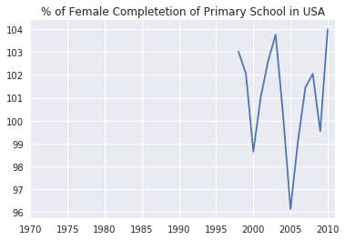

# Lesson 2: Numpy & Pandas for 1-D data

> Based Udacity's UD170 Introduction to Data Analysis. Last Updated 7th Feb 2017.


## 1-D Data Structures

Python has simple lists as 1-D Data Structure. Numpy has 1D Array and Pandas have Series.

__Numpy Arrays__: Simpler to Use than Pandas Series. Way Better Performance than simple lists.

__Pandas Series__: More Features as compare to both simple lists & Numpy Arrays. Built on Top of Numpy Arrays.


__Pandas__ also comes with a lot of utility functions for data analysis such as reading a csv, finding all uniques. Its even makes data manipulation faster.


## Dataset & Questions Phase

Dataset for this lesson: Gapminder Countries Data. [Data Descriptions](data_files/table_descriptions_gapminder.txt)

1. [Employment Above 15](data_files/employment_above_15.csv)
2. [Life Expectancy](data_files/life_expectancy.csv)
3. [GDP Per Capita](data_files/gdp_per_capita.csv)
4. School Completion Rates for [Females](data_files/female_completion_rate.csv) and [Males](data_files/male_completion_rate).

__Questions__

1. How has employment in the US[Or any other Country] varied over time?
2. What are the highest and lowest Employment Rates in the US[Or any other Country]?


## Numpy Arrays vs Python Lists

| Similarities | Differences  |
|--|---|
| Access Elements by Position: `A[1]` | In Numpy Arrays, Each Element should be of same type|
| Access a Range of Elements: `A[1:4]`| Convenient functions eg. std, mean built in for Numpy Arrays|
| Usage of loop to iterate.| Numpy Arrays can be multi-dimensional |


```python
# First Import Pandas and numpy
import pandas as pd
import numpy as np

```


```python
# Reading a csv with pandas
daily_engagement = pd.read_csv('data_files/daily_engagement.csv')

# Find the uniques based on account_key column
unique_students = daily_engagement['acct'].unique()

len(unique_students)
```

__OUTPUT__


    1237


## Vectorized Operations

__Vector__: List of numbers/values.

__Vector Addition__: Add corresponding elements of each input vector


eg. `[1, 2, 4] + [5, 6, 8]` => `[6, 8, 12]`

__Multiplication By A Scalar__: Each Element is multiplied by the scalar individually.


eg `[1, 3, 6] * 3` => `[3, 9, 18]`

#### More Vectorized Operations:

| Math Operations     | Logical Operations | Comparision Operations |
|---------------------|--------------------|------------------------|
| Vector Addition: `+`| Logical AND: `&`   | `>`, `>=`, `<`, `<=`   |
| Subtract: `-`       | OR: same as python | Equality: `==`, `!=`   |
| Multiply: `*`       | NOT `~`            |                        
| Divide: `/`         | __Read Note 1__    |                        
| Exponentiate: `**`  |                                          

__Note 1__: Make Sure you have boolean arrays for Logical Operations, otherwise Bitwise Operations will occur, which may not be what you want. Symbol for logical OR is `||`.

## Standardizing the Data

__Why Standardize?__: To find out how does one data point compare to the rest of the Data points in the data set.

__Standardizing__: Convert each point to a number of standard deviations away from the mean.


For a Dataset X, with mean 𝓾 and standard deviation σ, then for a data point x<sub>i</sub>, the standardized value would be.


x<sub>i<sub>new</sub></sub> = (x<sub>i</sub> - 𝓾) / σ

Links:

- [What's the difference between Normalization and Standardization? | Stack Exchange](http://stats.stackexchange.com/questions/10289/whats-the-difference-between-normalization-and-standardization)

- [Standardization vs. normalization](http://www.dataminingblog.com/standardization-vs-normalization/)


```python
# Standardizing the data

countries = np.array([
    'Afghanistan', 'Albania', 'Algeria', 'Angola', 'Argentina',
    'Armenia', 'Australia', 'Austria', 'Azerbaijan', 'Bahamas',
    'Bahrain', 'Bangladesh', 'Barbados', 'Belarus', 'Belgium',
    'Belize', 'Benin', 'Bhutan', 'Bolivia',
    'Bosnia and Herzegovina'
])


employment = np.array([
    55.70000076,  51.40000153,  50.5       ,  75.69999695,
    58.40000153,  40.09999847,  61.5       ,  57.09999847,
    60.90000153,  66.59999847,  60.40000153,  68.09999847,
    66.90000153,  53.40000153,  48.59999847,  56.79999924,
    71.59999847,  58.40000153,  70.40000153,  41.20000076
])

def standardize_data(values):
    mean = np.mean(values)
    std = np.std(values)
    return (values - mean) / float(std)

standardize_data(employment)
```

__OUTPUT__


    array([-0.31965231, -0.780123  , -0.87650077,  1.82207181, -0.03051941,
           -1.99019768,  0.30144772, -0.16973184,  0.23719615,  0.84758731,
            0.18365304,  1.00821665,  0.87971351, -0.56595055, -1.07996476,
           -0.20185762,  1.38301845, -0.03051941,  1.2545153 , -1.87240259])


## Numpy Index Arrays

Eg. Suppose you have two arrays of same length, first one contains data and other one just contains booleans.

a -> `[1, 2, 3, 4, 5]`

b -> `[T, F, F, T, T]` - Index Array

Then `a[b]` would be `[1, 4, 5]` (Keeps the elements whose index is true in the index array)

To create boolean array you can use comparision operators like `a > 2`

To find every element in the dataset greater than 2, you can use `a[a>2]`.

## `+` vs `+=` in Numpy Arrays.

- `+=` will do the Vector Addition __INPLACE__, will change the input array.

- `+` will return a new array.

- `+=` operates __INPLACE__ while `+` does not.

- NON-INPLACE operations should be preferred as they are relatively easier to think about.

## Pandas Series

- Very Similar to Numpy Arrays, but Series come will extra functionality

- for eg. `S.describe()` prints out mean, max, std, min and some other points of data for the series `S`

#### Similarites with Numpy Arrays

- Accessing Elements `S[0]`, `S[1]`
- Accessing Range of Elements  `S[1:4]`
- Looping: `for x in S`
- Convenient Functions: `S.mean()`, `S.max()`
- Vectorized Operations: `S1 + S2`
- Implemented on top of Numpy Arrays.

#### Pandas Series Indexes

`S = pd.Series(data, index=[indexes_array])`

- you can specify index names for each of the positions in the Series.

- Therefore A Pandas Series is like a cross between a list and a dictionary.

- The to lookup by index: `S.loc(some_index)`

- `S.argmax()` would then return the index for the max value.(rather than position)


```python
# Panda Series Practice.

countries = ['Albania', 'Algeria', 'Andorra', 'Angola', 'Antigua and Barbuda',
             'Argentina', 'Armenia', 'Australia', 'Austria', 'Azerbaijan',
             'Bahamas', 'Bahrain', 'Bangladesh', 'Barbados', 'Belarus',
             'Belgium', 'Belize', 'Benin', 'Bhutan', 'Bolivia']

life_expectancy_values = [74.7,  75. ,  83.4,  57.6,  74.6,  75.4,  72.3,  81.5,  80.2,
                          70.3,  72.1,  76.4,  68.1,  75.2,  69.8,  79.4,  70.8,  62.7,
                          67.3,  70.6]

gdp_values = [ 1681.61390973,   2155.48523109,  21495.80508273,    562.98768478,
              13495.1274663 ,   9388.68852258,   1424.19056199,  24765.54890176,
              27036.48733192,   1945.63754911,  21721.61840978,  13373.21993972,
                483.97086804,   9783.98417323,   2253.46411147,  25034.66692293,
               3680.91642923,    366.04496652,   1175.92638695,   1132.21387981]
life_expectancy = pd.Series(life_expectancy_values)
gdp = pd.Series(gdp_values)

def variable_correlation(variable1, variable2):
    '''
    Fill in this function to calculate the number of data points for which
    the directions of variable1 and variable2 relative to the mean are the
    same, and the number of data points for which they are different.
    Direction here means whether each value is above or below its mean.

    You can classify cases where the value is equal to the mean for one or
    both variables however you like.

    Each argument will be a Pandas series.

    For example, if the inputs were pd.Series([1, 2, 3, 4]) and
    pd.Series([4, 5, 6, 7]), then the output would be (4, 0).
    This is because 1 and 4 are both below their means, 2 and 5 are both
    below, 3 and 6 are both above, and 4 and 7 are both above.

    On the other hand, if the inputs were pd.Series([1, 2, 3, 4]) and
    pd.Series([7, 6, 5, 4]), then the output would be (0, 4).
    This is because 1 is below its mean but 7 is above its mean, and
    so on.
    '''
    v1mean, v2mean = variable1.mean(), variable2.mean()
    v1plus, v2plus = variable1 > v1mean, variable2 > v2mean
    num_same_direction = 0
    num_different_direction = 0


    for i in range(len(v1plus)):
        dir1, dir2 = v1plus[i], v2plus[i]
        num_same_direction +=  ( dir1 == dir2 )
        num_different_direction +=  (dir1 != dir2 )

    return (num_same_direction, num_different_direction)

variable_correlation(life_expectancy, gdp)
```

__OUTPUT__


    (17, 3)


## Vectorized Operations w/ Series Indexes.

Vectorized Operations with Series Indexes can be thought clearly with these two Rules:

1. Order of Indexes does not matter.
2. If some Indexes don't overlap, NAN will be the result for that Index.

Check out the Examples below.


```python


print "Block 1"
# Addition when indexes are the same
if True:
    s1 = pd.Series([1, 2, 3, 4], index=['a', 'b', 'c', 'd'])
    s2 = pd.Series([10, 20, 30, 40], index=['a', 'b', 'c', 'd'])
    print s1 + s2


print "Block 2"
# Indexes have same elements in a different order
if True:
    s1 = pd.Series([1, 2, 3, 4], index=['a', 'b', 'c', 'd'])
    s2 = pd.Series([10, 20, 30, 40], index=['b', 'd', 'a', 'c'])
    print s1 + s2


print "Block 3"
# Indexes overlap, but do not have exactly the same elements
if True:
    s1 = pd.Series([1, 2, 3, 4], index=['a', 'b', 'c', 'd'])
    s2 = pd.Series([10, 20, 30, 40], index=['c', 'd', 'e', 'f'])
    print s1 + s2


print "Block 4"
# Indexes do not overlap
if True:
    s1 = pd.Series([1, 2, 3, 4], index=['a', 'b', 'c', 'd'])
    s2 = pd.Series([10, 20, 30, 40], index=['e', 'f', 'g', 'h'])
    print s1 + s2
```
__OUTPUT__

    Block 1
    a    11
    b    22
    c    33
    d    44
    dtype: int64
    Block 2
    a    31
    b    12
    c    43
    d    24
    dtype: int64
    Block 3
    a     NaN
    b     NaN
    c    13.0
    d    24.0
    e     NaN
    f     NaN
    dtype: float64
    Block 4
    a   NaN
    b   NaN
    c   NaN
    d   NaN
    e   NaN
    f   NaN
    g   NaN
    h   NaN
    dtype: float64


## Fixing Missing Values

- Fix missing values by using (`Series.dropna`) which will drop any NAN indexes.

- __Better Solution__: Treat missing values as 0 before the addition.

Use `S.add()` function instead of `+` operator - `S1.add(S2, fill_value=0)` - This would convert missing values to 0 before Vector Addition.


## Non Built-In Calculations

- Option 1: Treat Series as an Iterator and therefore manipulate it by using loops.

- Option 2: Use the function `Series.apply()`

- `apply` takes a series and a function as its arguments and returns a new series where the function is applied to each element individually. Its like `map` function in Python.


## Plotting with Pandas

- You can just use basic matplotlib as with python lists and numpy arrays.
    - `pyplot.hist(data)`

- But Pandas comes with built-in plotting that used matplotlib internally.

Eg. If `data` is a Pandas Series:

`data.hist()` -> gives out a histogram

`data.plot()` -> gives out a line plot of the series.


```python
# Pandas Plotting Excercise. May need to change where the data files are.

import pandas as pd
import seaborn as sns

# The following code reads all the Gapminder data into Pandas DataFrames. You'll
# learn about DataFrames next lesson.

path = 'data_files/'
employment = pd.read_csv(path + 'employment_above_15.csv', index_col='Country')
female_completion = pd.read_csv(path + 'female_completion_rate.csv', index_col='Country')
male_completion = pd.read_csv(path + 'male_completion_rate.csv', index_col='Country')
life_expectancy = pd.read_csv(path + 'life_expectancy.csv', index_col='Country')
gdp = pd.read_csv(path + 'gdp_per_capita.csv', index_col='Country')

# The following code creates a Pandas Series for each variable for the United States.
# You can change the string 'United States' to a country of your choice.

employment_us = employment.loc['United States']
female_completion_us = female_completion.loc['United States']
male_completion_us = male_completion.loc['United States']
life_expectancy_us = life_expectancy.loc['United States']
gdp_us = gdp.loc['United States']

# Uncomment the following line of code to see the available country names
# print employment.index.values
# print employment

# Use the Series defined above to create a plot of each variable over time for
# the country of your choice. You will only be able to display one plot at a time
# with each "Test Run".
%pylab inline
female_completion_us.plot(title="% of Female Completetion of Primary School in USA")
```

__OUTPUT__

    Populating the interactive namespace from numpy and matplotlib



